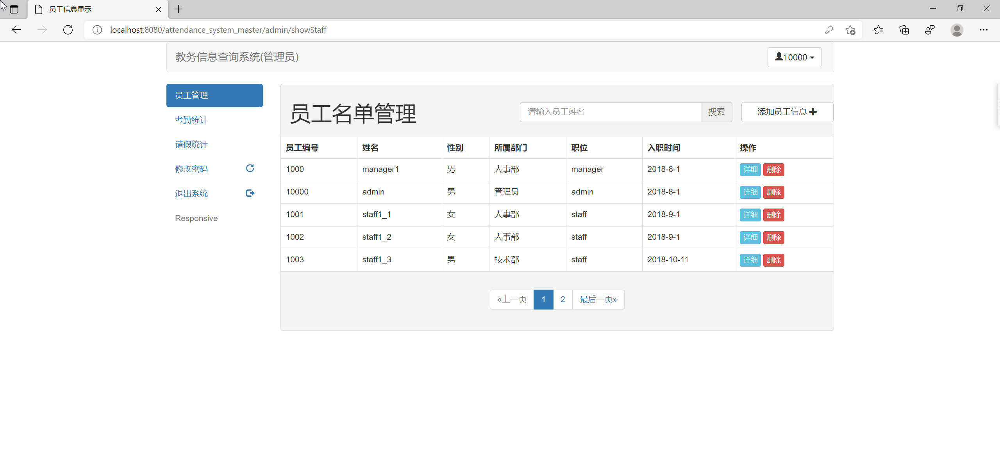
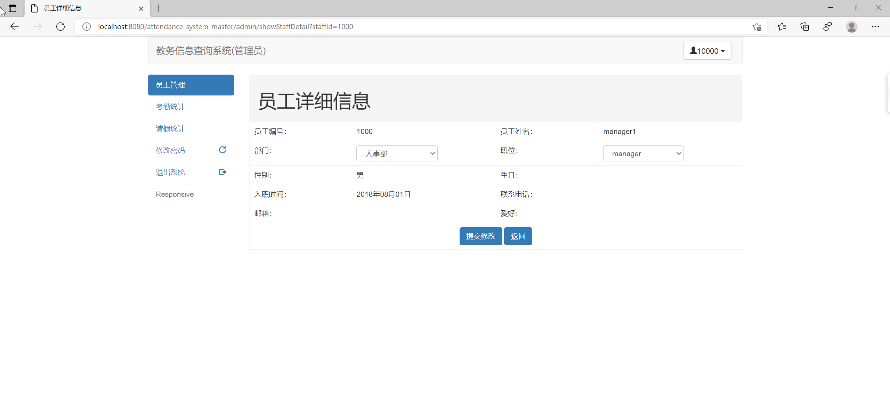
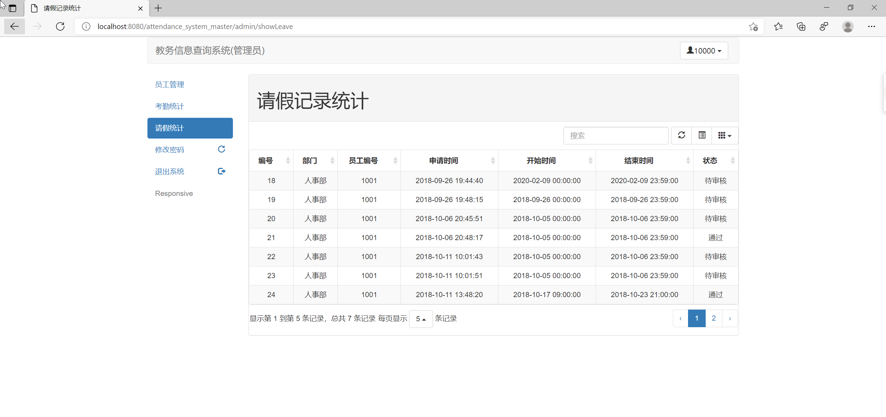
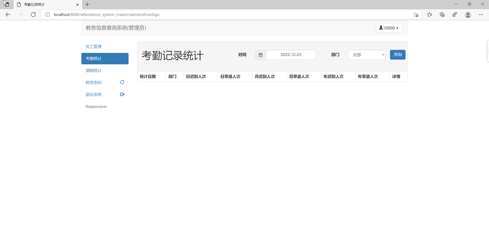
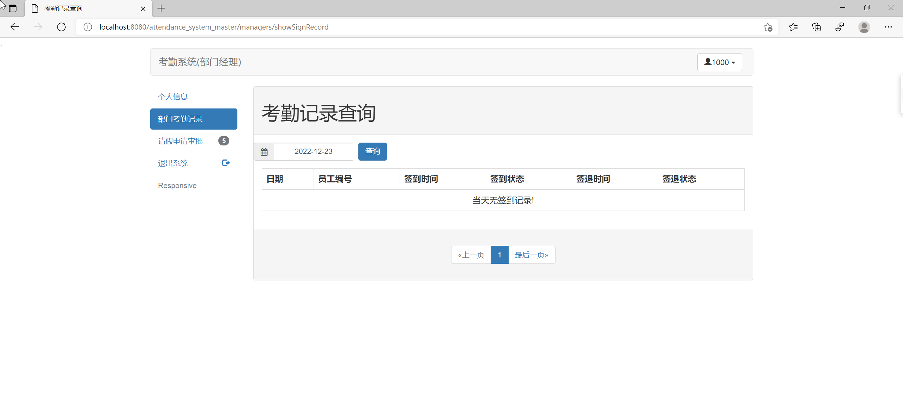
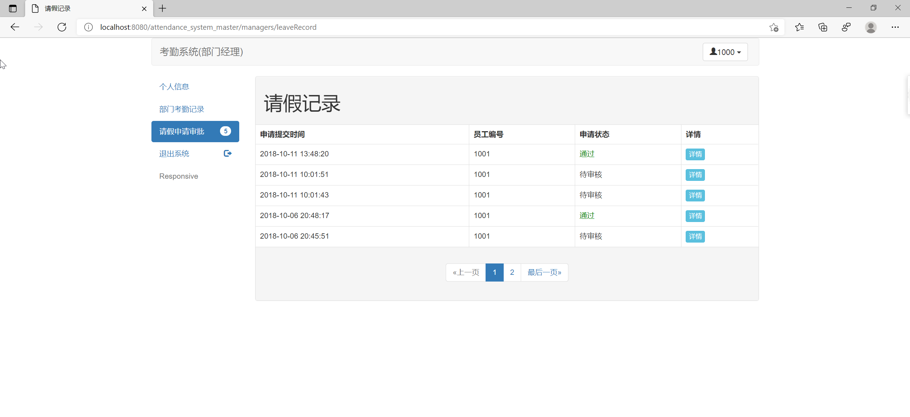
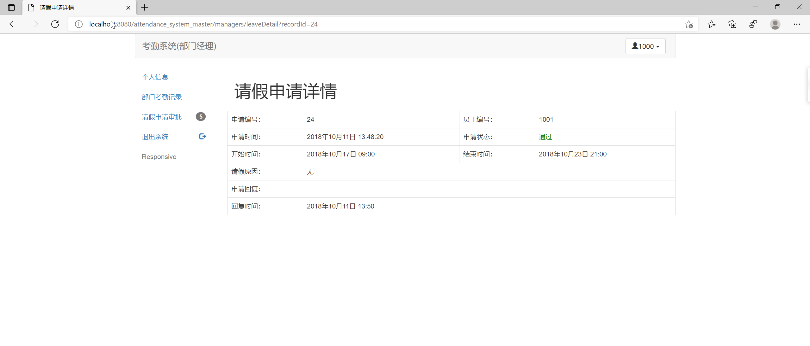
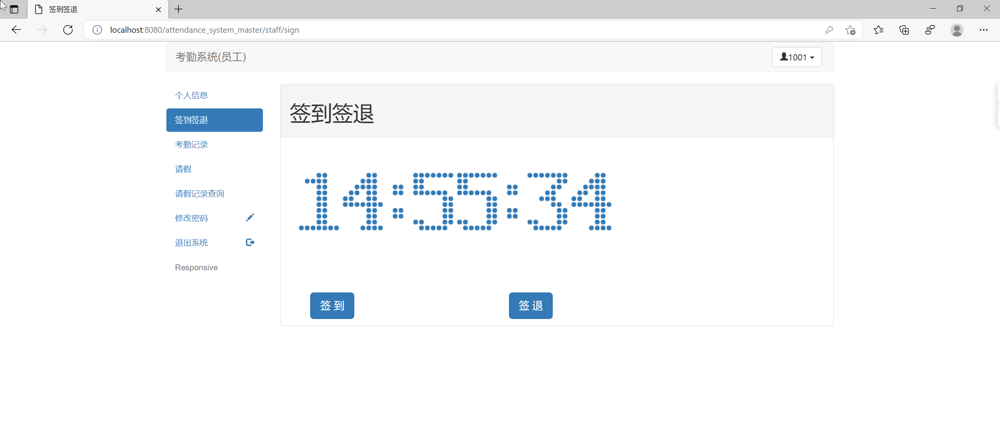
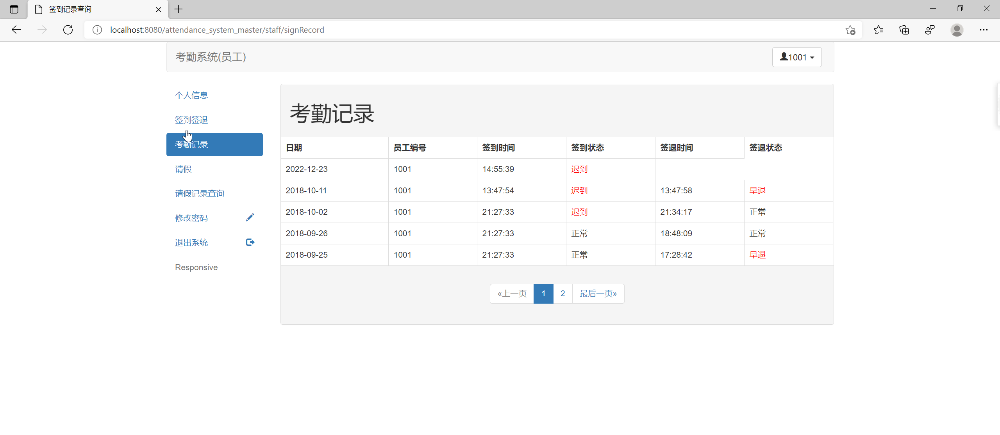

## 基于SSM的考勤管理系统

###  获取sql数据库文件: 从戎源码网 (https://armycodes.com/) QQ: 386869957 QQ群: 377586148
###  所有系统地址: (https://github.com/YuLin-Coder/AllProjectCatalog) 
###  所有项目以及源代码本人均调试运行无问题 可支持远程安装部署调试、定制修改、代码讲解

## 项目介绍
基于SSM的考勤管理系统，系统分为员工、经理、经理管理员三个角色，主要功能如下
员工用户: 能够查看个人信息, 查找个人信息, 并实时点击签到, 能够填写表单进行请假申请, 之后经理通过后即表示请假通过 
经理角色: 经理角色能够查看整个部门的考勤记录, 并查询部门的员工请假审批, 之后可以选择通过或者不通过 
管理员角色: 管理员角色能够进行所有的员工信息录入管理 包含姓名性别职位的修改删除, 以及能够查询所有的考勤统计与请假统计

## 项目技术
- 编程语言：Java
- 数据库：MySQL
- 前端技术：JSP、JavaScript、bootstrap、JQuery
- 后端技术：Spring、SpringMVC、MyBatis

## 运行环境
- JDK版本：JDK1.8及以上
- 开发工具：IDEA、Ecplise、Myecplise都可以
- 数据库: MySQL5.7及以上
- Maven：maven3.0及以上

## 运行截图

